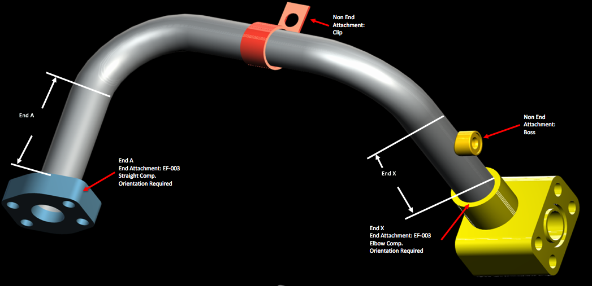
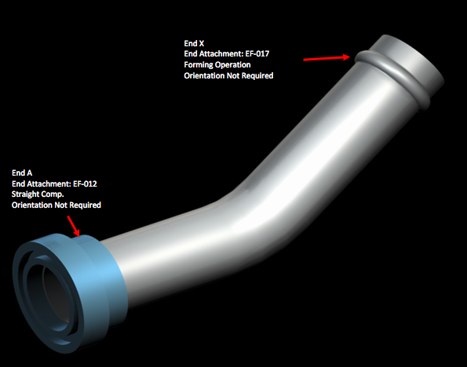

### Model quoted prices for industrial tube assemblies

Walking past a construction site, Caterpillar's signature bright yellow machinery is one of the first things you'll notice. Caterpillar sells an enormous variety of larger-than-life construction and mining equipment to companies across the globe. Each machine relies on a complex set of tubes (yes, tubes!) to keep the forklift lifting, the loader loading, and the bulldozer from dozing off. 

Like snowflakes, it's difficult to find two tubes in Caterpillar's diverse catalogue of machinery that are exactly alike. Tubes can vary across a number of dimensions, including base materials, number of bends, bend radius, bolt patterns, and end types.

Currently, Caterpillar relies on a variety of suppliers to manufacture these tube assemblies, each having their own unique pricing model. This competition provides detailed tube, component, and annual volume datasets, and challenges you to predict the price a supplier will quote for a given tube assembly.

### Dataset
The dataset is comprised of a large number of relational tables that describe the physical properties of tube assemblies. You are challenged to combine the characteristics of each tube assembly with supplier pricing dynamics in order to forecast a quote price for each tube. The quote price is labeled as cost in the data.

### Notations
In this dataset, there is no blank cell. The `NA` values mean that a value is not applicable to a specific field property. The value `0` always means a numerical value, not a boolean value like `false` nor a missing value. The notation `Y` means `YES` and can be treated as the boolean value `true`. The notation `N` means `NO` and can be treated as the boolean value `false`. Finally, the value `NONE` means that there is no such component on a certain tube assembly.

There are also many identifiant codes used in fields [Table]_id. Here are the list:

| Code           | Full name |
| -------------- | --------- |
| A              | Type End Form |
| B              | Connection Type |
| C              | Component |
| CP             | Component Type |
| EF             | Tube End Form |
| SP             | Specs (for material) |
| TA             | Tube Assembly |

### File descriptions

#### train_set.csv and test_set.csv

This file contains information on price quotes from our suppliers. Prices can be quoted in 2 ways: bracket and non-bracket pricing. Bracket pricing has multiple levels of purchase based on quantity (in other words, the cost is given assuming a purchase of quantity tubes). Non-bracket pricing has a minimum order amount (min_order) for which the price would apply. Each quote is issued with an annual_usage, an estimate of how many tube assemblies will be purchased in a given year.

| Variable           | Description |
| ------------------ | ----------- |
| id                 | Auto-increment number starting to 1. |
| tube_assembly_id   | The tube assembly ID (TA-xxxxx). |
| supplier           | The supplier who quotes the price of a tube assembly. |
| quote_date         | Date when the supplier quotes the price on a tube assembly. |
| annual_usage       | An estimate of how many tube assemblies will be purchased in a given year. |
| min_order_quantity | Non-bracket pricing has a minimum order amount for which the price would apply. |
| bracket_pricing    | Prices can be quoted in 2 ways: bracket and non-bracket pricing. Bracket pricing has multiple levels of purchase based on quantity (in other words, the cost is given assuming a purchase of quantity tubes). Non-bracket pricing has a minimum order amount (min_order) for which the price would apply. |
| quantity           | The quantity of tubes to purchase. |
| cost               | The cost depends of the bracket price and the pruchase of quantity tubes. |

#### tube.csv

This file contains information on tube assemblies, which are the primary focus of the competition. Tube Assemblies are made of multiple parts. The main piece is the tube which has a specific diameter, wall thickness, length, number of bends and bend radius. Either end of the tube (End A or End X) typically has some form of end connection allowing the tube assembly to attach to other features. Special tooling is typically required for short end straight lengths (end_a_1x, end_a_2x refer to if the end length is less than 1 times or 2 times the tube diameter, respectively). Other components can be permanently attached to a tube such as bosses, brackets or other custom features.

Source of images: [https://www.kaggle.com/c/caterpillar-tube-pricing/data](https://www.kaggle.com/c/caterpillar-tube-pricing/data)
   
   

| Variable           | Description |
| ------------------ | ----------- |
| tube_assembly_id   | The tube assembly ID (TA-xxxxx). |
| material_id        | The material used, represented by his ID, for the tube assembly. |
| diameter           | Typical diameter of tubes used in this tube assembly. |
| wall               | Typical wall thickness of tubes used in this tube assembly. |
| length             | Total length of this tube assembly. |
| num_bends          | Total number of bends in this tube assembly. |
| bend_radius        | Typical bend radius for this tube assembly. |
| end_a_1x           | (Y) If the end straight length is less than 1 times the tube diameter. (N) otherwise |
| end_a_2x           | (Y) If the end straight length is less than 2 times the tube diameter. (N) otherwise |
| end_x_1x           | (Y) If the end length is less than 1 times the tube diameter. (N) otherwise |
| end_x_2x           | (Y) If the end length is less than 2 times the tube diameter. (N) otherwise |
| end_a              | ID of end form tube which typically has some form of end connection allowing the tube assembly to attach to other features. |
| end_x              | ID of end form tube which typically has some form of end connection allowing the tube assembly to attach to other features. |
| num_boss           | Total number of bosses attached to a tube in this tube assembly. |
| num_bracket        | Total number of brackets attached to a tube in this tube assembly. |
| other              | Total number of other components attached to a tube in this tube assembly. |

#### bill_of_materials.csv

This file contains the list of components, and their quantities, used on each tube assembly.

#### specs.csv

This file contains the list of unique specifications for the tube assembly. These can refer to materials, processes, rust protection, etc.

#### tube_end_form.csv

Some end types are physically formed utilizing only the wall of the tube. These are listed here.

#### components.csv

This file contains the list of all of the components used. Component_type_id refers to the category that each component falls under.

#### comp_[type].csv

These files contain the information for each component.

#### type_[type].csv

These files contain the names for each feature.

